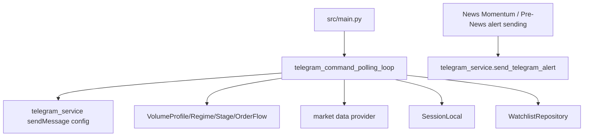

# Oracle Lean Refactor Phase 2C Dependency Extraction

Generated: 2026-06-03

## Scope And Guardrails

This is a documentation and dependency-analysis pass only.

No files were deleted, moved, archived, or behavior-modified. This report does not change News Momentum, Pre-News, Rocket Model Shadow, Telegram alert sending, or SEC Intelligence.

Goal: define the extraction work required to separate strategic systems from legacy systems so a later Phase 3 archive/move can be executed safely.

## Summary

| Blocker | Current archive readiness | Risk | Estimated effort | Phase 3 safe today? |
|---|---:|---|---|---|
| `src/core/finviz_scanner.py` | 45/100 | High | 1-2 days | No |
| Shared DB/schema modules | 30/100 | High | 3-5 days | No |
| `frontend/src/api.js` | 60/100 | Medium | 1-2 days | Partial |
| Telegram command system | 55/100 | High | 1 day | Partial |

## 1. `finviz_scanner.py`

### Current Dependency Map

| Dependent | System | Required functions | Strategic? | Notes |
|---|---|---|---:|---|
| `src/core/agentic/pre_news_detector.py` | Pre-News | `FINVIZ_UNDER2_URL`, `FinvizScanner._scrape_finviz_tickers(validate=False)` | Yes | Uses ticker-only discovery for top gainers and under-$2 high-volume universe. Does not need yfinance validation or `ScannedStock` enrichment. |
| `src/main.py` | News Momentum runtime | `FinvizScanner._scrape_finviz_tickers()` and under-$2 ticker scrape | Yes | Builds hot ticker set for ticker-specific Finviz quote-page news. This is strategic discovery, but it currently calls private scanner internals. |
| `src/core/agentic/news_momentum_eod_review.py` | News Momentum EOD missed-runner review | `FinvizScanner.scan_gainers()` | Yes | Needs enriched top gainer snapshot with ticker/change percent, currently via yfinance-backed `ScannedStock`. |
| `src/core/agentic/pre_news_learning.py` | Pre-News EOD missed review | `FinvizScanner.scan_gainers()` | Yes | Reviews large movers against pre-news anomalies; needs gainer snapshot. |
| `src/api/routes/scanner.py` | Legacy scanner route | `scan_gainers()`, `scan_under_2()` | No | Route is legacy and lean-gated. |
| `src/services/signal_service.py` | Legacy signal generation | `scan_gainers()`, `scan_under_2()` | No | Legacy signal stack. |
| `tests/unit/test_finviz_scanner_parser.py` | Parser coverage | `_scrape_finviz_tickers()` | Shared test | Should migrate to the new strategic parser helper during extraction. |

### Required Strategic Functions

| Function need | Current source | Required by | Keep behavior? | Extraction target |
|---|---|---|---:|---|
| Fetch Finviz top-gainer ticker symbols | `_scrape_finviz_tickers(FINVIZ_GAINERS_URL, validate=False)` | Pre-News, News Momentum ticker-specific news | Yes | `src/core/agentic/finviz_universe.py` |
| Fetch Finviz under-$2 high-volume ticker symbols | `_scrape_finviz_tickers(FINVIZ_UNDER2_URL, validate=False)` | Pre-News, News Momentum ticker-specific news | Yes | `src/core/agentic/finviz_universe.py` |
| Parse ticker symbols from Finviz HTML | `_scrape_finviz_tickers()` internals | All Finviz strategic callers | Yes | `src/core/agentic/finviz_universe.py` or shared `src/core/finviz_parser.py` |
| Fetch top-gainer mover snapshot | `scan_gainers()` | News Momentum EOD, Pre-News learning | Yes | `src/core/agentic/finviz_movers.py` |
| Bad ticker cache support | `_load_bad_tickers()`, `_save_bad_tickers()`, `_validate_tickers()` | Legacy scanner, possibly mover snapshots | Mostly | Shared utility only if validation remains needed for snapshots. |

### Legacy Functions

| Function | Legacy consumer | Future action |
|---|---|---|
| `scan_under_2()` returning enriched `ScannedStock` rows | `src/api/routes/scanner.py`, `src/services/signal_service.py` | Leave until legacy scanner/signal stack is archived. |
| `scan_gainers()` as scanner route output | `src/api/routes/scanner.py`, `src/services/signal_service.py` | Replace strategic use first, then archive legacy consumers later. |
| `_fetch_market_data()` yfinance enrichment to `ScannedStock` | Legacy scanner and EOD currently | Replace EOD with strategic mover DTO, keep old path for legacy until archive. |

### Shared Utilities

| Utility | Recommended owner | Reason |
|---|---|---|
| HTTP fetch with Finviz browser headers | `src/core/finviz_http.py` or private helper in `finviz_universe.py` | Used by ticker scrape and mover scrape. |
| Finviz ticker-link parser | `src/core/finviz_parser.py` or private helper in `finviz_universe.py` | Parser is the stable reusable piece currently tested. |
| Bad ticker JSON cache | `src/core/agentic/ticker_validation.py` | Avoid coupling strategic discovery to legacy scanner class state. |

### Proposed Target Module Structure

| New module | Responsibility |
|---|---|
| `src/core/agentic/finviz_universe.py` | Strategic ticker-only discovery: top gainers and under-$2 high-volume tickers. No `ScannedStock`, no legacy scanner route concerns. |
| `src/core/agentic/finviz_movers.py` | Strategic EOD mover snapshots for News Momentum and Pre-News missed-runner review. |
| `src/core/agentic/mover_models.py` | Small DTO such as `MoverSnapshot(ticker, price, volume, rvol, change_percent, source)`. |
| `src/core/finviz_scanner.py` | Temporary legacy adapter that can call the new helpers, retained for legacy routes/services until archive. |

### Extraction Plan

1. Create strategic ticker parser tests by copying the current Finviz parser case from `tests/unit/test_finviz_scanner_parser.py`.
2. Implement `finviz_universe.py` with public functions for top gainers and under-$2 tickers.
3. Update `pre_news_detector.py` and the News Momentum quote-page news path in `src/main.py` to call the new public functions.
4. Implement `finviz_movers.py` with an EOD snapshot function and a focused DTO.
5. Update `news_momentum_eod_review.py` and `pre_news_learning.py` to use the mover snapshot function.
6. Leave `finviz_scanner.py` as a legacy adapter for scanner routes and signal service until Phase 3.

### Risk, Effort, Readiness

| Metric | Value |
|---|---|
| Risk level | High |
| Estimated effort | 1-2 days including tests |
| Archive readiness score | 45/100 |

## 2. Shared DB And Schema Modules

### Current Dependency Graph

```mermaid
flowchart TD
  Main["src/main.py"] --> DBBase["src/models/database.py: Base"]
  Main --> Session["src/db/session.py: SessionLocal/engine"]
  PreNews["src/core/agentic/pre_news_detector.py"] --> Session
  PreNews --> Repo["src/db/repositories.py: WatchlistRepository"]
  TelegramCmd["src/services/telegram_command_handler.py"] --> Session
  TelegramCmd --> Repo
  WatchlistRoute["src/api/routes/watchlist.py"] --> Repo
  WatchlistRoute --> Schemas["src/models/schemas.py: Watchlist schemas"]
  SignalRoute["src/api/routes/signals.py"] --> SignalRepo["SignalRepository / SignalOutcomeRepository"]
  SignalService["src/services/signal_service.py"] --> LegacySchemas["Dip/Bounce/TradingSignal schemas"]
  MarketProviders["market data providers"] --> OHLCV["src/models/schemas.py: OHLCVBar"]
  AgenticEngines["agentic engines"] --> OHLCV
  Finviz["src/core/finviz_scanner.py"] --> ScannedStock["src/models/schemas.py: ScannedStock"]
```

### Strategic Models

| Model/schema | Current file | Strategic consumers | Recommendation |
|---|---|---|---|
| `OHLCVBar` | `src/models/schemas.py` | `src/services/market_data.py`, `src/services/polygon_provider.py`, `src/services/alphavantage_provider.py`, `src/core/agentic/*` timing/trap/momentum engines | Extract first to `src/models/market_data.py` or `src/core/market_data/models.py`. |
| `ScannedStock` | `src/models/schemas.py` | Strategic only through `finviz_scanner.py` EOD paths; legacy scanner also uses it | Replace strategic use with `MoverSnapshot`, then keep `ScannedStock` legacy-only. |
| `Watchlist` table | `src/models/database.py` | Pre-News manual universe via `WatchlistRepository.get_all_active()` | Mixed. Either keep as manual-universe table or replace with smaller strategic `TrackedTicker` table. |
| `WatchlistRepository.get_all_active()` | `src/db/repositories.py` | Pre-News detector | Extract minimal read-only strategic repository if manual universe remains strategic. |
| `Base`, `engine`, `SessionLocal` | `src/models/database.py`, `src/db/session.py` | App startup, Pre-News, Telegram command watchlist | Keep. Not archive candidates. |

### Legacy-Only Models

| Model/schema/repository | Current file | Legacy consumers | Archive condition |
|---|---|---|---|
| `Signal`, `SignalOutcome`, `ScanResult`, `TradeLog` | `src/models/database.py` | signal routes, logging service, old ML trainer, outcome simulator | Archive after signal routes, outcome simulator, logging service, old trainer are removed or replaced. |
| `SignalRepository`, `SignalOutcomeRepository`, `ScanResultRepository`, `TradeLogRepository` | `src/db/repositories.py` | legacy signals/outcome simulator/logging | Archive with legacy signal stack. |
| `WatchlistAlert`, `WatchlistTimeline`, `CustomAlert` | `src/models/database.py` | watchlist UI/service/custom alert routes | Archive only after strategic manual-universe dependency is separated. |
| Watchlist response/custom alert schemas | `src/models/schemas.py` | `src/api/routes/watchlist.py`, `src/services/watchlist_service.py` | Archive with watchlist UI/service. |
| Dip/bounce/signal/backtest schemas | `src/models/schemas.py` | old analysis, old scanner, backtest, signal service, dip/bounce ML | Archive with legacy analysis/signal/backtest cluster. |

### Shared Primitives

| Primitive | Current status | Extraction recommendation |
|---|---|---|
| `OHLCVBar` | Strategic and legacy | Extract to strategic market-data models first; update strategic providers/agentic engines. |
| `Base` and `SessionLocal` | Shared infrastructure | Keep as infrastructure. Do not archive. |
| `ScannedStock` | Mixed but legacy-shaped | Replace strategic use with `MoverSnapshot`; leave `ScannedStock` behind for legacy scanner. |
| `WatchlistRepository.get_all_active()` | Mixed | Extract read-only strategic manual-universe adapter or replace with `TrackedTickerRepository`. |

### Recommended Extraction Order

1. Extract `OHLCVBar` to a strategic market-data model module and update strategic market providers/agentic engines.
2. Extract Finviz `MoverSnapshot` and remove strategic dependence on `ScannedStock`.
3. Decide manual-universe policy:
   - If manual tickers remain strategic, create a minimal `TrackedTicker` or read-only `StrategicWatchlistRepository`.
   - If manual tickers are not strategic, remove Pre-News watchlist expansion in a later behavior-change phase, not now.
4. Split `src/models/schemas.py` into strategic/shared and legacy schema modules.
5. Split `src/db/repositories.py` into strategic DB access and legacy repositories.
6. Only after import scans are clean, archive legacy database models and repositories.

### Risk, Effort, Readiness

| Metric | Value |
|---|---|
| Risk level | High |
| Estimated effort | 3-5 days including tests and migration checks |
| Archive readiness score | 30/100 |

## 3. `frontend/src/api.js`

### Current Dependency Map

| Frontend page | API dependency class | Strategic? |
|---|---|---:|
| `frontend/src/pages/NewsMomentum.jsx` | News Momentum helpers | Yes |
| `frontend/src/pages/Agentic.jsx` | Agentic, Pre-News, quality separator, news impact, old agentic ML advisory helpers | Mostly yes; old advisory controls need review |
| `frontend/src/pages/HistoricalTraining.jsx` | Historical/Rocket training helpers | Yes |
| `frontend/src/pages/SECIntelligence.jsx` | SEC helpers | Yes |
| `frontend/src/pages/News.jsx` | News helpers plus `getLiveQuote` from old analysis route | Mixed |
| `frontend/src/pages/Dashboard.jsx` | signals, health, watchlist, Trading212 discovery | Legacy except health |
| `frontend/src/pages/Analysis.jsx` | old analysis/orderflow/watchlist/live quote | Legacy |
| `frontend/src/pages/Watchlist.jsx` | watchlist helpers | Legacy UI, with strategic manual-universe question unresolved |
| `frontend/src/pages/Backtest.jsx` | backtest helper | Legacy |
| `frontend/src/pages/Performance.jsx` | performance/adjustment helpers | Legacy |
| `frontend/src/pages/Settings.jsx` | health plus old dip/bounce model helpers | Mixed |
| `frontend/src/pages/Intelligence.jsx` | old intelligence/trade tracking/live quote | Legacy |
| `frontend/src/pages/ActiveTrades.jsx` | old intelligence active trade helpers | Legacy |

### Export Inventory

| Helper | Classification | Notes |
|---|---|---|
| `getSignals` | Legacy | Old signal generation. |
| `analyzeSignal` | Legacy | Old signal detail. |
| `recordOutcome` | Legacy | Old signal outcome path. |
| `getVolumeProfile` | Legacy | Old analysis route. |
| `getRegime` | Legacy | Old analysis route. |
| `getStage` | Legacy | Old analysis route. |
| `getSegment` | Legacy | Old analysis route. |
| `getCompleteAnalysis` | Legacy | Old analysis aggregate. |
| `getLiveQuote` | Shared/Mixed | Used by legacy pages and strategic `News.jsx`; needs strategic market-data endpoint or lean-mode removal from News. |
| `getFinvizNews` | Strategic | News ingestion UI. |
| `getStockTitanNews` | Strategic | News ingestion UI. |
| `getAllNews` | Strategic | News ingestion UI. |
| `getBearishAnalysis` | Legacy | Old analysis. |
| `getOrderFlow` | Legacy | Old analysis/order-flow route. |
| `runBacktest` | Legacy | Old backtest UI. |
| `getPerformance` | Legacy | Old signal performance. |
| `getAdjustments` | Legacy | Old learning adjustments. |
| `getModelStatus` | Legacy | Old dip/bounce model route. |
| `trainModels` | Legacy | Old dip/bounce model route. |
| `discoverTickers` | Legacy | Old scanner route. |
| `getWatchlist` | Legacy/Mixed | UI legacy; manual-universe policy unresolved. |
| `addToWatchlist` | Legacy/Mixed | Used by legacy pages; could become strategic only if rebuilt as manual-universe endpoint. |
| `getWatchlistDetail` | Legacy | Watchlist UI. |
| `updateWatchlistItem` | Legacy | Watchlist UI. |
| `removeFromWatchlist` | Legacy | Watchlist UI. |
| `archiveWatchlistItem` | Legacy | Watchlist UI. |
| `restoreWatchlistItem` | Legacy | Watchlist UI. |
| `getWatchlistAlerts` | Legacy | Watchlist UI alerts. |
| `getTickerAlerts` | Legacy | Watchlist UI alerts. |
| `markAlertRead` | Legacy | Watchlist UI alerts. |
| `getTickerTimeline` | Legacy | Watchlist UI timeline. |
| `refreshWatchlist` | Legacy | Watchlist UI/service. |
| `refreshWatchlistItem` | Legacy | Watchlist UI/service. |
| `getCustomAlerts` | Legacy | Watchlist custom alerts. |
| `createCustomAlert` | Legacy | Watchlist custom alerts. |
| `deleteCustomAlert` | Legacy | Watchlist custom alerts. |
| `getAllActiveAlerts` | Legacy | Watchlist custom alerts. |
| `getTickerEarnings` | Legacy | Watchlist earnings. |
| `refreshEarningsCalendar` | Legacy | Watchlist earnings. |
| `checkEarningsWarnings` | Legacy | Watchlist earnings. |
| `getTickerNews` | Legacy | Watchlist news panel. |
| `analyzeIntelligence` | Legacy | Old intelligence route. |
| `analyzeBatchIntelligence` | Legacy | Old intelligence route. |
| `getMarketContext` | Legacy | Old intelligence route. |
| `getActiveTrades` | Legacy | Old intelligence active trades. |
| `startTradeTracking` | Legacy | Old intelligence trade tracking. |
| `updateTradeTracking` | Legacy | Old intelligence trade tracking. |
| `closeTradeTracking` | Legacy | Old intelligence trade tracking. |
| `getLearningWeights` | Legacy | Old intelligence learning. |
| `computeLearningAdjustments` | Legacy | Old intelligence learning. |
| `discoverTrading212` | Legacy | Old scanner discovery. |
| `getHealth` | Shared | Safe shared utility. |
| `agenticScan` | Strategic | Agentic/Pre-News UI. |
| `agenticRefreshAll` | Strategic | Agentic UI; currently exported but not prominently used. |
| `agenticCandidates` | Strategic | Agentic candidates. |
| `agenticCandidateDetail` | Strategic | Agentic candidate detail. |
| `agenticRefreshCandidate` | Strategic | Agentic candidate refresh. |
| `agenticDeactivate` | Strategic | Agentic candidate lifecycle. |
| `agenticAlerts` | Strategic | Agentic alerts. |
| `agenticStatus` | Strategic | Agentic status. |
| `agenticLearningStats` | Strategic | Agentic learning visibility. |
| `qualitySeparatorStatus` | Strategic | Agentic quality separator. |
| `qualitySeparatorProfiles` | Strategic | Agentic quality separator. |
| `qualitySeparatorEvaluate` | Strategic | Agentic quality separator. |
| `qualitySeparatorReport` | Strategic | Agentic quality separator. |
| `agenticRecordOutcome` | Strategic | Agentic learning route; verify against newer outcome resolver before promotion. |
| `agenticApplyWeights` | Strategic | Agentic learning controls. |
| `agenticRollbackWeights` | Strategic | Agentic learning controls. |
| `agenticMissedOpportunities` | Strategic | Agentic missed-opportunity review. |
| `mlTrain` | Mixed | Old agentic ML advisory, not Rocket CatBoost shadow. Keep out of Rocket production claims. |
| `mlStatus` | Mixed | Old agentic ML advisory status. |
| `mlApprove` | Mixed | Old agentic ML advisory approval. |
| `mlDrift` | Mixed | Old agentic ML advisory drift. |
| `mlPredict` | Mixed | Old agentic ML advisory prediction. |
| `newsImpactCandidates` | Strategic | News impact learning. |
| `newsImpactDetail` | Strategic | News impact detail. |
| `newsImpactEvaluate` | Strategic | News impact evaluation. |
| `newsImpactLearningSummary` | Strategic | News impact learning. |
| `newsImpactLearningRecommendations` | Strategic | News impact learning. |
| `preNewsScan` | Strategic | Pre-News. |
| `preNewsAnomalies` | Strategic | Pre-News. |
| `preNewsDetail` | Strategic | Pre-News. |
| `preNewsLearning` | Strategic | Pre-News. |
| `preNewsMissedReview` | Strategic | Pre-News. |
| `preNewsEvaluation` | Strategic | Pre-News validation/evaluation. |
| `preNewsExportEvaluation` | Strategic | Pre-News evaluation exports. |
| `preNewsExportList` | Strategic | Pre-News evaluation exports. |
| `preNewsAnalyze` | Strategic | Pre-News evaluation. |
| `preNewsReport` | Strategic | Pre-News report. |
| `preNewsReportMarkdown` | Strategic | Pre-News report. |
| `preNewsBaselines` | Strategic | Pre-News baselines. |
| `preNewsBaselinesSummary` | Strategic | Pre-News baselines. |
| `preNewsBaselinesExport` | Strategic | Pre-News baselines. |
| `historicalTrainingRun` | Strategic | Historical/Rocket training pipeline. |
| `historicalTrainingStatus` | Strategic | Historical/Rocket training pipeline. |
| `historicalTrainingInsights` | Strategic | Historical/Rocket training pipeline. |
| `historicalTrainingRecommendations` | Strategic | Historical/Rocket training pipeline. |
| `historicalTrainingApply` | Strategic | Historical/Rocket training pipeline. |
| `historicalTrainingRollback` | Strategic | Historical/Rocket training pipeline. |
| `historicalTrainingEvents` | Strategic | Historical/Rocket training pipeline. |
| `historicalTrainingAddEvent` | Strategic | Historical/Rocket training pipeline. |
| `historicalTrainingBuildDataset` | Strategic | Historical/Rocket training pipeline. |
| `historicalTrainingResults` | Strategic | Historical/Rocket training pipeline. |
| `historicalTrainingMissedOpportunities` | Strategic | Historical/Rocket training pipeline. |
| `newsMomentumCandidates` | Strategic | News Momentum. |
| `newsMomentumCandidate` | Strategic | News Momentum. |
| `newsMomentumDeactivate` | Strategic | News Momentum. |
| `newsMomentumTopRanked` | Strategic | News Momentum. |
| `newsMomentumTopExpectedReturn` | Strategic | News Momentum. |
| `newsMomentumTopContinuation` | Strategic | News Momentum. |
| `newsMomentumTopMultiday` | Strategic | News Momentum. |
| `newsMomentumTelegramQuality` | Strategic | News Momentum Telegram quality review. |
| `newsMomentumHistory` | Strategic | News Momentum history; exported but not currently used by page scan. |
| `newsMomentumConfig` | Strategic | News Momentum config. |
| `newsMomentumUpdateConfig` | Strategic | News Momentum config. |
| `newsMomentumScanNow` | Strategic | News Momentum scan trigger. |
| `newsMomentumStats` | Strategic | News Momentum stats. |
| `newsMomentumCatalystStats` | Strategic | News Momentum catalyst stats. |
| `newsMomentumClassifyHeadline` | Strategic | News Momentum classifier debug/tooling. |
| `newsMomentumMissedWinners` | Strategic | News Momentum missed winners. |
| `newsMomentumMissedWinnersReport` | Strategic | News Momentum missed winners. |
| `newsMomentumUpdateMissedStatus` | Strategic | News Momentum missed winners. |
| `newsMomentumApplyShadow` | Strategic | News Momentum shadow learning control; keep separate from production alert logic. |
| `secCandidates` | Strategic | SEC Intelligence. |
| `secCandidateDetail` | Strategic | SEC Intelligence. |
| `secFilings` | Strategic | SEC Intelligence. |
| `secFilingsForTicker` | Strategic | SEC Intelligence. |
| `secDilutionRisk` | Strategic | SEC Intelligence. |
| `secStructuralTraps` | Strategic | SEC Intelligence. |
| `secCleanWatchlist` | Strategic | SEC clean-watchlist concept, not legacy DB watchlist UI. |
| `secSerialDiluters` | Strategic | SEC Intelligence. |
| `secHistory` | Strategic | SEC Intelligence. |
| `secScanNow` | Strategic | SEC Intelligence. |
| `secStats` | Strategic | SEC Intelligence. |

### Proposed Split

| File | Contents |
|---|---|
| `frontend/src/api/shared.js` | `BASE`, `DEFAULT_TIMEOUT_MS`, `fetchJSON`, `getHealth`. |
| `frontend/src/api_strategic.js` | News, Agentic, Pre-News, Historical/Rocket training, News Momentum, SEC helpers, and any future strategic market quote helper. |
| `frontend/src/api_legacy.js` | Signal, old analysis, backtest, old model, scanner/discovery, watchlist UI, old intelligence/trade tracking helpers. |
| `frontend/src/api.js` | Temporary compatibility barrel that re-exports both until page imports are migrated. |

### Extraction Plan

1. Create `shared.js` with `fetchJSON` and health.
2. Create `api_strategic.js` and copy strategic helpers only.
3. Create `api_legacy.js` and copy legacy helpers.
4. Update strategic pages to import from `api_strategic.js`.
5. Update legacy pages to import from `api_legacy.js`.
6. Resolve `News.jsx` use of `getLiveQuote` by adding a strategic quote helper or removing quote enrichment in lean mode.
7. Keep `api.js` as compatibility layer until all imports are migrated.

### Risk, Effort, Readiness

| Metric | Value |
|---|---|
| Risk level | Medium |
| Estimated effort | 1-2 days including frontend build |
| Archive readiness score | 60/100 |

## 4. Telegram Command System

### Current Command Inventory

| Command | Handler | Classification | Dependencies | Removal blocker |
|---|---|---|---|---|
| `/analysis TICKER` | `_handle_analysis_command()` | Legacy | `get_market_data_provider`, `VolumeProfileEngine`, `RegimeDetector`, `StageDetector`, optional `OrderFlowAnalyzer` | Top-level imports load old analysis modules when command polling imports. |
| `/orderflow TICKER` | `_handle_orderflow_command()` | Legacy | `get_market_data_provider`, optional `OrderFlowAnalyzer` | Old order-flow module import. |
| `/watch TICKER [bullish|bearish]` | `_handle_watch_command()` | Mixed | `SessionLocal`, `WatchlistRepository` | Manual ticker tracking may be strategic for Pre-News, but current watchlist implementation is legacy UI/service coupled. |
| `/help` | `_handle_help()` | Mixed | Command list text | Must become lean-mode aware once commands are feature-gated. |
| Unknown slash commands | fallback in `telegram_command_polling_loop()` | Shared | Telegram send helper | Keep fallback. |

### Dependency Map

Important separation: Telegram alert sending is not the same as Telegram command handling. Alert sending must stay untouched. The command handler is the import blocker.

### Extraction Plan

1. Keep `src/services/telegram_service.py` unchanged.
2. Move legacy `/analysis` and `/orderflow` dependencies inside their handlers or a future `telegram_legacy_commands.py`.
3. Add command feature flags in a future behavior-preserving phase:
   - legacy analysis commands disabled in lean mode.
   - `/watch` either disabled or routed to a new strategic manual-universe command.
4. Split command modules:
   - `src/services/telegram_command_handler.py` as polling/router shell.
   - `src/services/telegram_commands_legacy.py` for `/analysis` and `/orderflow`.
   - `src/services/telegram_commands_universe.py` for future strategic ticker tracking if retained.
5. Update `/help` to render only enabled commands.

### Risk, Effort, Readiness

| Metric | Value |
|---|---|
| Risk level | High |
| Estimated effort | 1 day including lean-mode import tests |
| Archive readiness score | 55/100 |

## Combined Extraction Order

1. Extract Finviz ticker-only universe functions.
2. Extract Finviz EOD mover snapshot functions.
3. Extract strategic market-data primitives from `src/models/schemas.py`.
4. Resolve manual-universe/watchlist policy.
5. Split DB repositories into strategic and legacy modules.
6. Split frontend API helpers into shared, strategic, and legacy files.
7. Resolve `News.jsx` live-quote dependency.
8. Split Telegram command routing from legacy command implementations.
9. Re-run backend tests and frontend lean build.
10. Re-run import scans proving strategic systems no longer import legacy modules.

## Is Phase 3 Archive Now Safe?

NO.

Justification:

- This Phase 2C pass produced the extraction plan only; it did not implement the extraction.
- `finviz_scanner.py` still has strategic callers in Pre-News, News Momentum runtime, and EOD missed-runner review.
- `src/models/schemas.py`, `src/models/database.py`, and `src/db/repositories.py` still contain strategic and legacy symbols in the same modules.
- `frontend/src/api.js` still mixes strategic and legacy helpers.
- Telegram command polling still imports legacy analysis modules at startup.

Phase 3 archive/move becomes safe only after the extraction steps above are implemented and verified with backend tests, frontend build, and lean-mode import tests.
